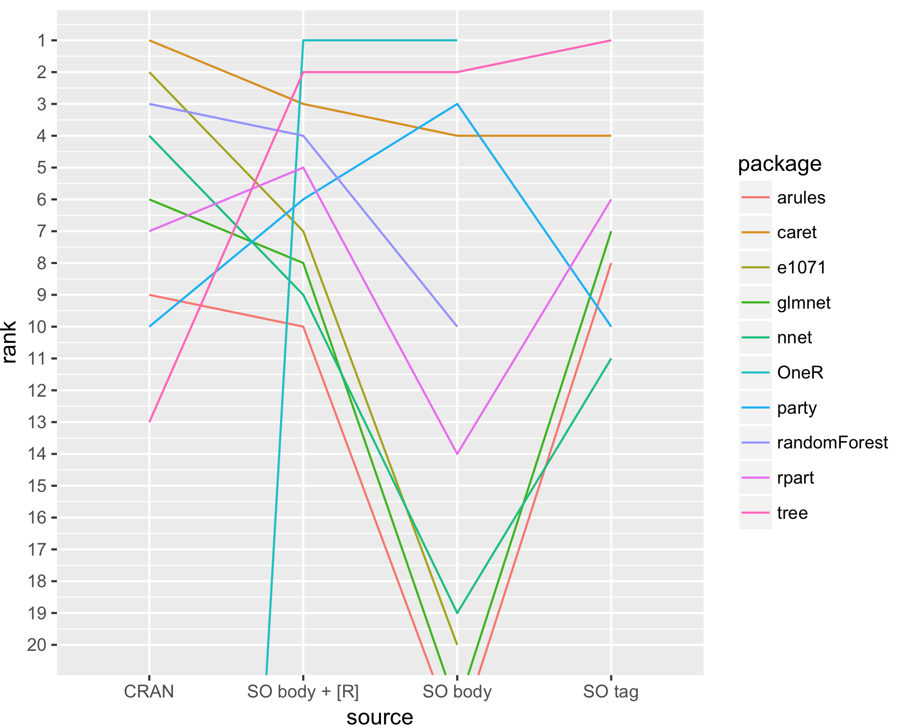

***I'm thinking of using a format like this, with large interactive image upfront:***

*[http://www.nytimes.com/interactive/2014/07/08/upshot/how-the-year-you-were-born-influences-your-politics.html](http://www.nytimes.com/interactive/2014/07/08/upshot/how-the-year-you-were-born-influences-your-politics.html)*

*(this is a draft, looking for big-picture feedback)*

# Top R packages for ML

*[this will be interactive, with D3?]*

What are the popular ML packages? Let's look at a ranking based on CRAN
downloads, and Stack Overflow (SO) activity

</img>

Data notes:

This is data from the past year.

CRAN = number of package downloads in last year

SO = stack overflow (pacakge name is in question body / package name is in
question body with [R] tag/ package name is an SO tag)

[TBD: add github stars to this list? and only use one "SO" result]

[add details on text]

# Identifying an exhaustive list of packages

Before ranking the packages to find the "top" ones, you need an exhaustive list
of R packages that are used for ML. 

This list can be scraped from a CRAN "Task View" for "Machine Learning and
Statistical Learning". It seems to be kept up-to-date (latest update: January
6, 2017), so kudos to its maintainer, Torsten Hothorn!

# How to define "best" or "top"?

Rankings should be based on some objective metrics that will yield "relevant"
results for the intended audience. 

One approach could be to rank the packages based on popularity. Instead of
creating a global ranking, we let you compare results from different sources.

# Using APIs to get usage statistics 

  * Stack Overflow
  * Github
  * (Meta) CRAN ?

How to precisely define the metrics? Look for tags?

Problems:

  * a small number of package names are common words: `earth`, `party`. We need
    to filter our results to those that are relevant to R.
  * APIs help a lot, but there are still quirks to figure out: it's useful to
    compare API results to a manual search results

See [Resources](#Resources) for code details!

# Results

See above for results. Here are some trending packages

[show recently trending packages from CRAN trends?]

# Other lists (limitations)

other lists are mostly of low quality:

  * old results
  * subjective ranking

# Resources

github link (working): [https://github.com/pavopax/data-science-blogs/tree/drafts](https://github.com/pavopax/data-science-blogs/tree/drafts)

