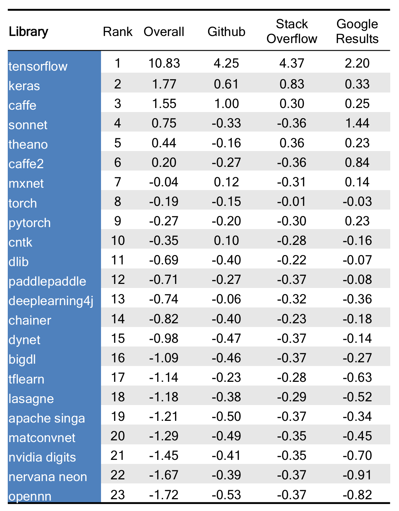

# Ranking Popular Deep Learning Libraries for Data Science

At [The Data Incubator](https://www.thedataincubator.com/), we pride ourselves on having the latest data science curriculum. Much of our curriculum is based on feedback from corporate and government partners about the technologies they are looking to learn.  However, we wanted to develop a more data-driven approach to what we should be teaching in our [data science corporate training](https://www.thedataincubator.com/training.html) and our [free fellowship](https://www.thedataincubator.com/fellowship.html) for masters and PhDs looking to enter data science careers in industry. Here are the results.

# The Rankings

Below is a ranking of deep learning libraries that are useful for Data Science, based on Github and Stack Overflow activity, as well as google search results. The table shows standardized scores, where a value of 1 means one standard deviation above average (average = score of 0). For example, `Caffe` is one standard deviation above average in Github activity, while `deeplearning4j` is close to average. See [below for methods](#Methods).

</img>

# Results and Discussion

The ranking is based on equally weighing its three components: Github (stars and forks), Stack Overflow (tags and questions), and number of Google search results. These were obtained using available APIs. Coming up with a comprehensive list of deep learning toolkits was tricky - in the end, we scraped five different lists that we thought were representative (see [methods](#Methods) below for details). Computing standardized scores for each metric allows us to see which packages stand out in each category. The [full ranking is here](output/DL_libraries_final_Rankings.csv), while the [raw data is here](output/deep_learning_data.csv).

## `TensorFlow` dominates the field with the largest active community
`TensorFlow` is at least four standard deviations above the mean on all calculated metrics. `TensorFlow` has almost three times as many Github forks and more than six times as many Stack Overflow questions than the second most popular library, `Caffe`. First open-sourced by the Google Brain team in 2015, `TensorFlow` has climbed over more senior libraries such as `Theano` (4) and `Torch` (5) for the top spot on our list. While `TensorFlow` is distributed with a Python API running on a C++ engine, several of the libraries on our list can utlize `TensorFlow` as a back-end and offer their own interfaces. These include `Keras` (3), which will [soon be part of core TensorFlow](https://twitter.com/fchollet/status/820746845068505088), `TFLearn` (11), and `sonnet` (16). The popularity of `TensorFlow` is likely due to a combination of its general-purpose deep learning framework, flexible interface, good-looking computational graph visualizations, and Google’s significant developer and community resources.

## `Caffe` has yet to be replaced by `Caffe2`
`Caffe` takes a strong second place on our list with more Github activity and Google search results than all of its competitors (excluding `TensorFlow`). `Caffe` is traditionally thought of as more specialized than `Tensorflow` and was developed with a focus on image processing, objection recognition, and pre-trained convolutional neural networks. Facebook released `Caffe2` (12) in April 2017, and it already ranks in the top half the deep learning libraries. `Caffe2` is a more lightweight, modular, and scalable version of `Caffe` that includes recurrent neural networks. `Caffe` and `Caffe2` are separate repos, so data scientists can continue to use the orginial `Caffe`. However, there are migration tools such as [Caffe Translator](https://github.com/caffe2/caffe2/blob/master/caffe2/python/caffe_translator.py) that provide a means of using `Caffe2` to drive existing `Caffe` models.

## `Keras` is the most popular front-end for deep learing
`Keras` (3) is highest ranked non-framework library. `Keras` can be used as a front-end for `TensorFlow` (1), `Theano` (4), `MXNet` (6), `CNTK` (7), or `deeplearning4j` (8). `Keras` performed better than average on all three metrics measured. The popularity of `Keras` is likely due to its simplicity and ease-of-use. `Keras` allows for fast protoyping at the cost of some of the flexibility and control that comes from working directly with a framework. `Keras` is favorited by data scientists experimenting with deep learning on their data sets. The development and popularity of `Keras` continues with R Studio recently releasing [an interface](https://keras.rstudio.com) in `R` for `Keras`.  

## `Theano` continues to hold a top spot even without large industry support
In a sea of new deep learning frameworks, `Theano` (4) has the distiction of the oldest library in our rankings. `Theano` pioneered the use of the computational graph and remains popular in the research community for deep learning and machine learning in general. `Theano` is essentially a numerical computation library for Python, but can be used with high-level deep learning wrappers like `Lasagne` (14). While Google supports `TensorFlow` (1) and `Keras` (3), Facebook backs `PyTorch` (9) and `Caffe2` (12), `MXNet` (6) is the offical deep learning framework of Amazon Web Services, and Microsoft designed and maintains `CNTK` (7), `Theano` remains popular without offical support from a technology industry giant.

## Python is the language of deep learning interfaces
Out of the 23 open-source deep learning frameworks and wrappers we ranked, only three did not have interfaces in Python: `Dlib` (13), `MatConvNet` (18), and `OpenNN` (23). C++ and R interfaces were available in seven and six of the 23 libraries, respectively. While the data science community has somewhat reached a consensus when it comes to using Python, there are still many options for deep learning.

# Limitations

As with [any analysis](https://twitter.com/benhamner/status/732392995610198016), decisions were made along the way. All source code and data is on [our Github Page](https://github.com/thedataincubator/data-science-blogs). The full list of deep learning libraries [came from a few sources](#Methods). 

Naturally, some libraries that have been around longer will have higher metrics, and therefore higher ranking. This is not adjusted for in any way.

The data presented a few difficulties:

*  `neural designer` and `wolfram mathematica` are proprietary and were removed
*  `cntk` is also called `microsoft cognitive toolkit`, but we only used the originial `ctnk` name
*  `neon` was changed to `nervana neon`
*  `paddle` was changed to `paddlepaddle`
*  Some libraries were obviously derivatives of other libraries, such as Caffe and Caffe2. We decided to treat libraries individidually if they had unique github repositories.

# Methods

All source code and data is on [our Github Page](https://github.com/thedataincubator/data-science-blogs).

We first generated a list of deep learning libraries [from](https://svds.com/understanding-ai-toolkits/) [each of](https://en.wikipedia.org/wiki/Comparison_of_deep_learning_software) [five](https://www.packtpub.com/books/content/top-10-deep-learning-frameworks) [different](https://twitter.com/fchollet/status/882995652233371648) [sources](https://svds.com/wp-content/uploads/2017/02/Deep_learning_ratings_final-1024x563.png), and then collected metrics for all of them, to come up with the ranking. Github data is based on both stars and forks, while Stack Overflow data is based on tags and questions containing the package name. Search results are from Google.

A few other notes:

* Several of the libraries were common words (caffe, chainer, lasagne), for this reason the search terms used to determine the number of google search results included the library name and the term "deep learning". 
* Any unavailable Stack Overflow counts were converted to zero count. 
* Counts were standardized to mean 0 and deviation 1, and then averaged to
  get Github and Stack Overflow scores, and, combined with Serch Results, the Overall score. 
* Some manual checks were done to confirm Github repository location.

All data was downloaded on September 6, 2017.

# Resources

Source code is available on [The Data Incubator](https://www.thedataincubator.com/)'s [Github (https://github.com/thedataincubator/data-science-blogs/). If you're interested in learning more, consider

1. [Data science corporate training](https://www.thedataincubator.com/training.html)
2. [Free eight-week fellowship](https://www.thedataincubator.com/fellowship.html) for masters and PhDs looking to enter industry
3. [Hiring Data Scientists](https://www.thedataincubator.com/hiring.html)

# Authors:
[Michael Li](https://github.com/tianhuil/) and [Rachel Allen](https://github.com/raykallen/).