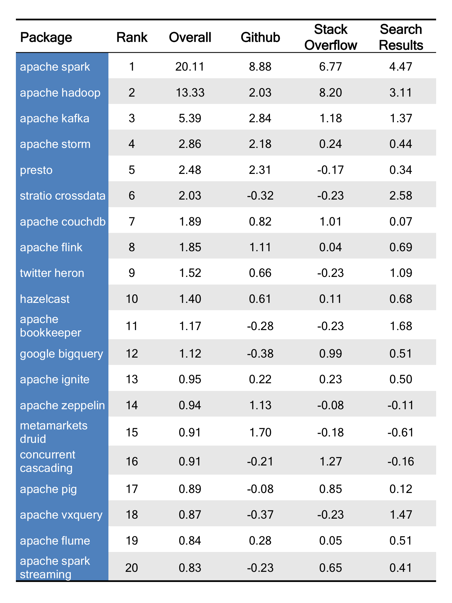

# Ranking Popular Distributed Computing Packages for Data Science

At [The Data Incubator](https://www.thedataincubator.com/), we pride ourselves on having the latest data science curriculum. Much of our curriculum is based on feedback from corporate and government partners about the technologies they are looking to learn.  However, we wanted to develop a more data-driven approach to what we should be teaching in our [data science corporate training](https://www.thedataincubator.com/training.html) and our [free fellowship](https://www.thedataincubator.com/fellowship.html) for masters and PhDs looking to enter data science careers in industry. Here are the results.

# The Rankings

Below is a ranking of the top 20 of 140 distributed computing packages that are useful for Data Science, based on Github and Stack Overflow activity, as well as Google Search results. The table shows standardized scores, where a value of 1 means one standard deviation above average (average = score of 0). For example, `Apache Hadoop` is 6.6 standard deviations above average in Stack Overflow activity, while `Apache Flink` is close to average. See [below for methods](#Methods).

</img>

# Results and Discussion

The package ranking is based on equally weighing its three components: Github (stars and forks), Stack Overflow (tags and questions), and number of Google search results. These were obtained using available APIs. Coming up with a comprehensive list of distributed computing packages was tricky - in the end, we scraped three different lists that we thought were representative. We chose to focus on 140 frameworks and distributed programing packages (see [methods](#Methods) below for details). Computing standardized scores for each metric allows us to see which packages stand out in each category. The [full ranking is here](output/DL_libraries_final_Rankings.csv), while the [raw data is here](output/distributed_computing_data.csv).

## `Apache Spark` and `Apache Hadoop` are in a class of their own
`Apache Spark` (1) is an incredibly popular open source distributed computing framework. `Apache Spark` dominated the Github activity metric with its numbers of forks and stars more than eight standard deviations above the mean. `Apache Spark` utlizes in-memory data processing, which makes it faster than its predecessors and capable of machine learning. It also offers an interactive console in either Scala or, more popular amoung data scientists, Python. Although `Apache Spark` was intially designed for the Hadoop ecosystem, it can run on its own using one of many different file management systems. `Apache Hadoop` (2) outperformed `Apache Spark` in Stack Overflow activity. The disconnect between Hadoop's Stack Overflow activity and the other two metrics is likely due to the fact that the meaning of `Apache Hadoop` has evolved over time. Rather than refering to just the framework, the term "Hadoop" can also mean all Hadoop-related projects that make up the ecosystem. This results in a somewhat inflated Stack Overflow score. Nevertheless, most of the frameworks and engines on our list have `Apache Hadoop` integrations. And it measured at least two standard deviations above the mean on all our metrics, solidifying its number two spot. 

## `Apache Storm` and `Apache Flink` are popular alternative frameworks, especially for streaming
`Apache Storm` (4), initally touted as the `Apache Hadoop` of real-time, is a stream-only framework best for near real-time distributed computing. It performed above average on all of our metrics. While `Apache Storm` processes stream data at scale, it is frequently used with `Apache Kafka` (3), a platform that processes the raw messages from real-time data feeds at scale. Similiar to `Apache Spark`, `Apache Flink` (8) is also a framework capable of both batch and stream processing. However, `Apache Spark` bills itself as a batch-processor that can handle streaming, while `Apache Flink` is suited for heavy stream processing with some batch tasks. 

## `Stratio Crossdata` is the highest ranked data hub and fastest growing package
`Stratio Crossdata` (6) extends the capabilites of `Apache Spark` by providing a unified way to access to multiple datastores. `Stratio Crossdata` uses a SQL-like language and just one API to access multiple datatstores with different natures, like `Apache Cassandra`, `ElasticSearch`, `Arvo`, or `MongoDB`. The number of Google search results for `Stratio Crossdata` have increased by 400% from the last quarter, which is the largest growth rate out of all 140 packages on our list.

## Two of the top 10 were developed by Twitter 
The most popular of the two Twitter projects on our list, `Apache Storm` (4), was donated to the Apache Software Foundation by Twitter in 2011. `Twitter Heron` (9) is a direct successor to `Apache Storm` released in June 2016. `Twitter Heron` offers improved realtime, fault-tolerant stream processing with higher throughput than Storm. `Twitter Heron` had the fifth largest quarterly growth rate with an increase of 180%. It will be interesting to see if `Twitter Heron` can climb farther up the ranks with time.

## The Hadoop Ecosystem dominates 
The Hadoop Ecosystem projects are the most prevalent and widely adopted distributed computing frameworks and interfaces. 17 of the top 20 packages we ranked are part of the Hadoop Ecosystem or designed to integrate with `Apache Spark` or `Apache Hadoop` (including HDFS). Outside of the Hadoop Ecosystem `Hazelcast` (10), an in-memory data grid, `Google BigQuery` (12), cloud-based big data analytics web service using a SQL-like syntax, and `Metamarkets Druid` (15) a framework for real-time analysis of large datasets performed well on our metrics.

# Limitations

As with [any analysis](https://twitter.com/benhamner/status/732392995610198016), decisions were made along the way. All source code and data is on [our Github Page](https://github.com/thedataincubator/data-science-blogs). The full list of distributed computing packages [came from a few sources](#Methods). 

Naturally, some libraries that have been around longer will have higher metrics, and therefore higher ranking. The only metric that takes this into account is the Google search quarterly growth rate.

The data presented a few difficulties:

*  Several of the libraries were common words (onyx, drools, disco), for this reason the search terms used to determine the number of google search results included an additional descriptive term("onyx platform", "kiegroup drools") or alias ("discoproject"). All search terms can be found [here](/data/DC_packages_results_google.csv).
*  Manual checks were done to confirm Stack Overflow tags and Github repository locations
*  Stack Overflow tags can be found [here](/data/DC_packages_results_stackoverflow.csv).
*  Github repository names can be found [here](/data/DC_packages_results_github.csv).

# Methods

All source code and data is on [our Github Page](https://github.com/thedataincubator/data-science-blogs).

We first generated a list of deep learning libraries from [the](https://github.com/onurakpolat/awesome-bigdata) [four](https://projects.apache.org/projects.html?category)[of these](http://analyticsindiamag.com/10-hadoop-alternatives-consider-big-data/) [sources](http://bigdata.andreamostosi.name/), and then collected metrics for all of them, to come up with the ranking. Github data is based on both stars and forks, while Stack Overflow data is based on tags and questions containing the package name. Search results are from Google.

A few other notes:
 * Any unavailable Stack Overflow or counts were converted to zero count. 
 * If no Github repository existed, forks and stars were recored as zero.
 * Counts were standardized to mean 0 and deviation 1, and then averaged to
  get Github and Stack Overflow scores, and, combined with Serch Results, the Overall score. 

All data was downloaded on September 19, 2017.

# Resources

Source code is available on [The Data Incubator](https://www.thedataincubator.com/)'s [Github (https://github.com/thedataincubator/data-science-blogs/). If you're interested in learning more, consider

1. [Data science corporate training](https://www.thedataincubator.com/training.html)
2. [Free eight-week fellowship](https://www.thedataincubator.com/fellowship.html) for masters and PhDs looking to enter industry
3. [Hiring Data Scientists](https://www.thedataincubator.com/hiring.html)

# Authors:
[Rachel Allen](https://github.com/raykallen/) and [Michael Li](https://github.com/tianhuil/)