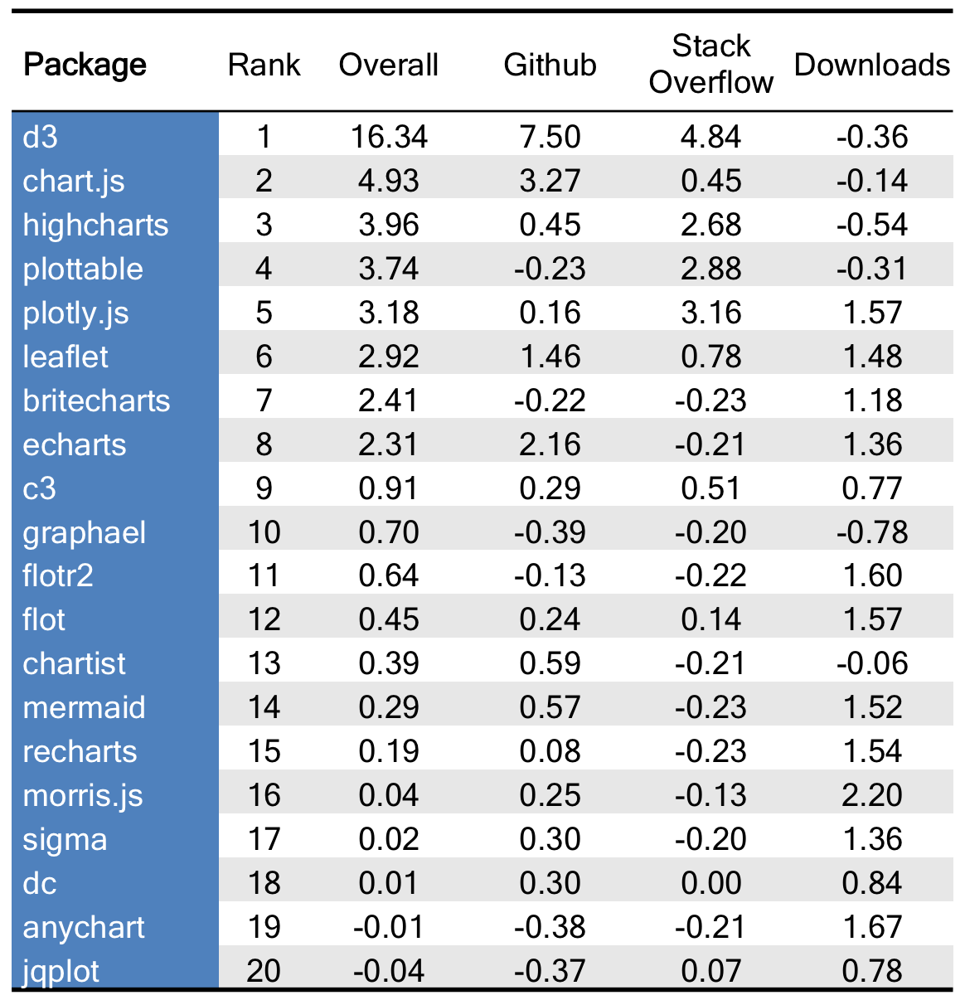

# Ranking Popular JavaScript Visualization Packages for Data Science

At [The Data Incubator](https://www.thedataincubator.com/), we pride ourselves on having the latest data science curriculum. Much of our curriculum is based on feedback from corporate and government partners about the technologies they are looking to learn.  However, we wanted to develop a more data-driven approach to what we should be teaching in our [data science corporate training](https://www.thedataincubator.com/training.html) and our [free fellowship](https://www.thedataincubator.com/fellowship.html) for masters and PhDs looking to enter data science careers in industry. Here are the results.

# The Rankings

Below is a ranking of JavaScript data visualization packages that are useful for Data Science, based on Github and Stack Overflow activity, as well as npmjs [(javascript package manager)](https://www.npmjs.com/) downloads. The table shows standardized scores, where a value of 1 means one standard deviation above average (average = score of 0). For example, `chart.js` is 3.29 standard deviations above average in Github activity, while `plotly.js` is close to average. See [below for methods](#Methods).

</img>

# Results and Discussion

The ranking is based on equally weighing its three components: Github (stars and forks), Stack Overflow (tags and questions), and npm downloads(totals and compounded monthly growth rate). These were obtained using available APIs. Coming up with a comprehensive list of JavaScript visualization packages was tricky - in the end, we scraped four different lists that we thought were representative (see [methods](#Methods) below for details) and ranked 141 JS packages (excluding d3-modules). Computing standardized scores for each metric allows us to see which packages stand out in each category. The [full ranking is here](output/js_viz_final_Rankings.csv), while the [raw data is here](output/JS_VIZ_data.csv).

## `d3.js` and its derivatives dominate the field

`d3.js` is at least four standard deviations above the mean on all calculated metrics. `d3.js` offers users full control of all aspects of their data visualizations. With this power comes a trade-off: `d3.js` does not come with built-in charts and making a simple bar graph can become quite time consuming. For this reason, dozens of reusable charting packages have been built upon `d3.js`. D3.js derivatives with premade components make up six of the top 20 packages on our list. These include: `plottable` (4), `plotly.js` (5), `britecharts` (7), `c3` (9), `recharts` (15), and `dc.js` (18). These derivatives tend to provide charting options for bar, line, and scatter plots. For more specialized visualizations such as maps and networks additional packages are necessary.

## `leaftlet.js` is the most popular map visualization package
`leaflet.js` (6) is the only package dedicated to mapping to break into the top 20 on our list with scores above the mean on all of our metrics. In addition to specializing in interactive maps, `leaflet.js` is lightweight (38KB of JS) and mobile-friendly. `cesium` (27) is the highest ranking package to offer 3D globes and maps. `cartodb` (29), `rickshaw` (37), and `datamaps` (46) also offer powerful geospatial/mapping visualizations.

## `sigma.js` beats `cytoscape` for the most popular graph/network visualization package
`sigma.js` (17) is a JavaScript library solely dedicated to graph drawing, but in fact it is the only package in our top 20 even capable of graph/network visualization (besides the customizations offered by `d3.js`). Another package specializing in graph theory, `cytoscape` (38) has a strong showing slightly outperforming `sigma.js` in StackOverflow and npmjs download activity. However, `sigma.js` weighs in with more than twice as many stars and forks on GitHub. 

## `britecharts` has the largest growth rate for 2017
With so many data visualization options (we ranked over 141), one might think it would be hard for a new charting package to gain a following. `britechars`, a reusable charting library based on D3.js and created by [eventbrite](https://www.eventbrite.com/engineering/introducing-britecharts/), was first made publicly available less than two years ago. `britecharts` earned the number 7 spot in our overall rankings, and the highest compound monthly growth rate (110%) over the last 6 months. The next package to even come close is `graphael` with a 56% growth rate.

## There's a place near the top for both `flot` and `flotr2`
`flot` (rhymes with plot) comes in just one spot behind its successor `flotr2`. `flot` is a pure JavaScript plotting library for jQuery, while `flotr2` has a similiar syntax but with no dependence on jQuery. Although it was released over five years ago, `flotr2` has yet to outperform `flot` in GitHub or StackOverflow activity. `flotr2` has a larger growth rate, but both packages rank highly on our list and continue to be actively maintained by separate groups.

# Limitations

As with [any analysis](https://twitter.com/benhamner/status/732392995610198016), decisions were made along the way. All source code and data is on [our Github Page](https://github.com/thedataincubator/data-science-blogs). The full list of JavaScript visualization packages [came from a few sources](#Methods), and packages were unranked, due to unavailable downloads and Github data. These include: `Google Charts`, `KoolCharts`, `TeeCharts`, `ZoomCharts`. 

Further, naturally, some packages that have been around longer will have higher metrics, and therefore higher ranking. This is not adjusted for in any way other than download metrics restricted to the past six months.

The data presented a few difficulties:

* The `plottable` has an inflated Stack Overflow (SO) question metrics since 
  it's a common word.
* SO data for `plotly` may also be inflated, as it's both an R and Python
  package.

# Methods

All source code and data is on [our Github Page](https://github.com/thedataincubator/data-science-blogs).

We first generated a list of Data Science packages [from](https://github.com/fasouto/awesome-dataviz') [these](https://github.com/wbkd/awesome-d3) [four](https://en.wikipedia.org/wiki/Comparison_of_JavaScript_charting_frameworks) [sources](https://cssauthor.com/javascript-charting-libraries), and then collected metrics for all of them, to come up with the ranking. Github data is based on both stars and forks, while Stack Overflow data is based on tags and questions containing the package name. Downloads data is from npmjs. Downloads were totaled over a six month period, and the compound monthly growth rate was calculated over the same period. After scraping other sites for JS visualization package names, we had gathered over 100 "unique" package names. Many of them were aliases for the same packages (d3, D3JS). If a the first result of github search returned the same repo as another package, we treated them as the same package, but saved the aliases to search Stack Overflow questions. 

A few other notes:

* Any unavailable Stack Overflow counts were converted to zero count. 
* Counts were standardized to mean 0 and deviation 1, and then averaged to
  get Github, Stack Overflow, and Download scores, and combined to get the Overall 
  score. 
* Some manual checks were done to confirm Github repository location.
* D3-modules were removed and d3-modules data [collection](code/make_D3_modules_data.ipynb), [analysis](code/D3_modules_analysis.ipynb), and [ranking](img/d3_mod_rank.png) were done separately.

All data was downloaded on August 6, 2017.

# Resources
Source code is available on [The Data Incubator](https://www.thedataincubator.com/)'s [Github (https://github.com/thedataincubator/data-science-blogs/). If you're interested in learning more, consider

1. [Data science corporate training](https://www.thedataincubator.com/training.html)
2. [Free eight-week fellowship](https://www.thedataincubator.com/fellowship.html) for masters and PhDs looking to enter industry
3. [Hiring Data Scientists](https://www.thedataincubator.com/hiring.html)

# Authors:
[Rachel Allen](https://github.com/raykallen/) and [Michael Li](https://github.com/tianhuil/)