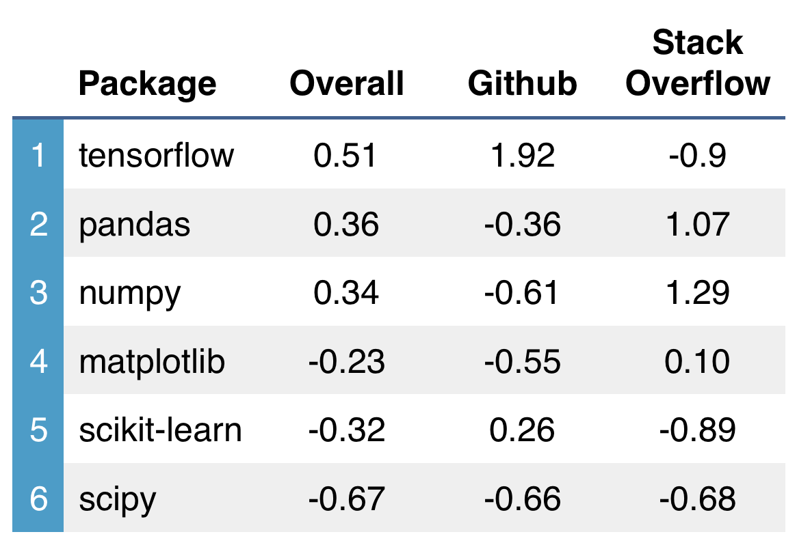

# [Draft] Ranking Popular Python Packages for Machine Learning

Here are standardized scores, based on Github and Stack Overflow activity.

</img>

*Scaled results shown. Overall, tensorflow is half a standard deviation above
average, based on combined Github and Stack Overflow activity. matplotlib is
close to average on Stack Overflow (0.1 is close to 0, the mean).*

# Results

inverse correlation betwen stack overflow and Github!

due to usability? pandas is not usable, so lots of questions...

Github = stars and forks

SO = tags and package name in question

# Limitations

packages were pre-selected, based on our datacousre imports...

added tensorflow for fun

# Methods

(similar to R)

standardize columns. take average of Z scores to get overall mean

data downloaded on 1/24/2017
