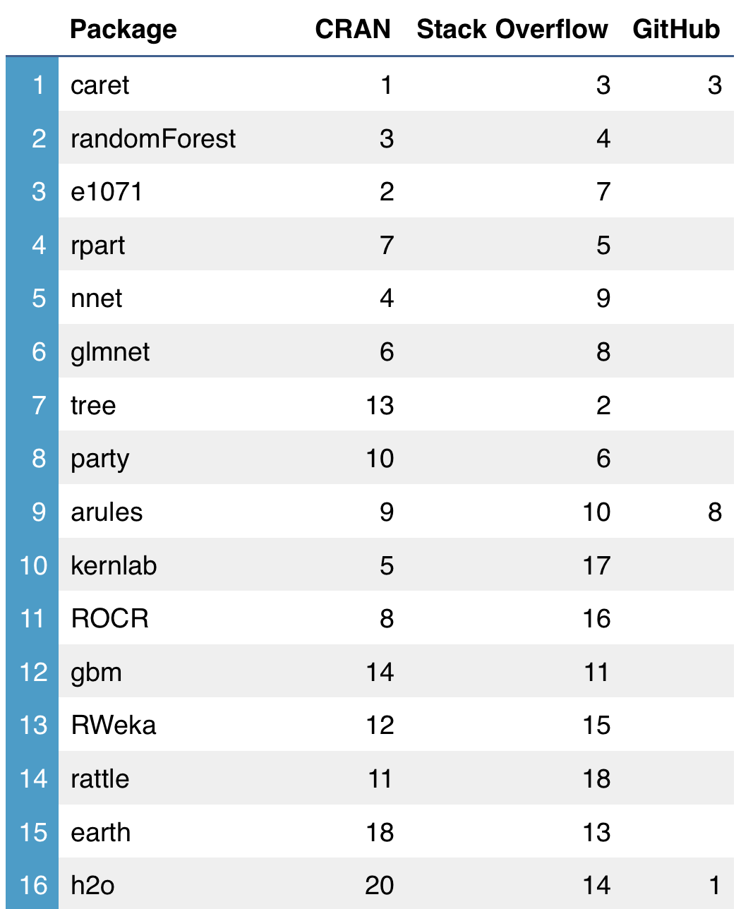

At The Data Incubator [The Data Incubator](https://www.thedataincubator.com/), we pride ourselves on having the latest data science curriculum.  Much of our curriculum is based on feedback from corporate and government partners about the technologies they are looking to learn.  But we wanted to develop a more data-driven approach to what we should be teaching in our [data science corporate training](https://www.thedataincubator.com/training.html) and our [free fellowship](https://www.thedataincubator.com/fellowship.html) for masters and PhDs looking to enter data science careers in industry.

# Top R packages for Machine Learning

What are the most popular ML packages? Let's look at a ranking based on package
downloads and social website activity.

</img>

*Notable: OneR: 1 (SO); mlr: 2 (Github); ranger: 4 (Github); SuperLearner: 5 (Github)*
	
The ranking is based on average rank of CRAN ([The Comprehensive R Archive Network](https://cran.r-project.org/)) downloads and Stack Overflow
activity ([full ranking here [CSV] ](ranking.csv)). CRAN downloads are from the past year. Stack Overflow ranks the
number of results based on package name in a question body, along with a tag
'R'. GitHub ranking is based on the number of stars for the
repository. See [below](#Methods) for methodological details.

# Caret on top, neural nets feature strongly among other algorithm heavyweights

Perhaps not surprisingly, `caret` is on top. It's a general package for
creating machine learning workflows, and it integrates well with some
algorithm-specific packages, which come next in the ranking.

These include `e1071` (for SVMs), `rpart` (trees), `glmnet` (regularized
regressions), and, perhaps surprisingly for R, neural networks (`nnet`). See details
on all of these packages [below](#Package-details)

The ranking reveals the fragmentation of the R package community. Several of
the top packages, such as `rpart` and `tree`, implement the same algorithms,
which contrasts with the uniformity - and breadth - of Python's `scikit-learn`.

Still, if you're loving R's for its data manipulation capabilities (as in the
`tidyverse`), then you can use these packages to perform some powerful
modeling, instead of switching to Python. Further, as more features are added
to [`modelr`](https://github.com/hadley/modelr), a `tidy tool`, we may soon see
it included in this list.

# Package details

`caret` is a general package for creating machine learning workflows, and it
comes out on top of this ranking. Next come a few packages implementing
specific machine learning algorithms: Random Forests (`randomForest`), Support
Vector Machines (`e1071`), Classification and Regression Trees (`rpart`), and
regularized regression models (`glmnet`).

`nnet` implements neural networks, while the `tree` package also
implements trees. `party` is for recursive partitioning and visualization of
binary trees, and `arules` is for association mining. SVMs and other kernel
methods are implemented in `kernlab`. The `h2o` package is for scalable machine
learning, and is part of the larger H2O project. `ROCR` is for model
evaluation, including ROC curves, while `gbm` implements gradient
boosting. More partitioning algorithms can be accessed with `RWeka`, while
`rattle` is an R GUI for data mining.

A few packages feature strongly on Github only: `mlr` and `SuperLearner` are 2
other meta-packages that offer similar functionality to `caret`, while `ranger`
offers C++ implementations of random forests.

Last, `OneR` is number one on Stack Overflow, but the SO API often
auto-corrects this to "one" so the result is unreliable.

# Methods

Below, we describe the methodology to come up with this ranking.

## Step 1: Obtain an exhaustive list of ML packages

From the beginning, we envisioned our ranking being built on a combination of
package downloads and Stack Overflow and Github activity. We knew that APIs
existed that would provide us with these metrics.

However, obtaining an initial list of all the R packages for Machine Learning
was a tougher task. This list needed to be exhaustive, objective, and
up-to-date. A bad initial list would affect our ranking dramatically.

Asking around helped. A friend pointed us to
the
["CRAN Task View: Machine Learning & Statistical Learning"](https://cran.r-project.org/web/views/MachineLearning.html) which
has a great list at the bottom, and is easy to scrape.

Its advantages are that the package list comes from an authoritative source
(CRAN is the "official" R package repository) and it is regularly updated (last
update: January 6, 2017). Kudos to the
author, [Torsten Hothorn](http://user.math.uzh.ch/hothorn/), who is also very
responsive via email.

A previous thought was to use Google to look up lists of "top R ML packages"
and then trying to scrape all the package names, combine them, and use that
list as a starting point. But setting aside the engineering task, we also found
that the currently available lists were of poor quality relative to our
needs. They were outdated, didn't clearly specify methods, and were often quite
subjective.

## Determine objective metrics

A good ranking needs a definition of what "best" means, and needs to be
constructed with good metrics.

We defined "best" as "most popular". This doesn't necessarily mean the packages
are widely-loved (users could be frequently searching Stack Overflow because
the API is horrible).

We chose 3 components for our ranking:

  * Downloads: number of downloads from a CRAN mirror
  * Github: number of stars for package on its main repository page
  * Stack Overflow: number of questions containing the package name and tagged
    with 'R'
    
## CRAN downloads

There are a few CRAN mirrors, and we used the R-Studio mirror since it has a
convenient API. RStudio must be the most widely used IDE for R, but it is not
the only one. Our ranking could be improved (though maybe not significantly) if
we aggregated downloads from other CRAN mirrors.

## GitHub

Initially, we looked for the packages' Github page by querying Github's search
API for the package name, perhaps with "language:R", but this proved
unreliable. It was sometimes hard to pick out the correct Github repo, and not
all R packages are implemented using the R language (the "language:R" parameter
in the search API seems to refer to the most popular language that the
repository is written in).

Instead, we went back to CRAN to find these urls. Each package has an official
CRAN page, which includes useful information, including source code links. This
is where we got the packages' Github repository location.

After that, obtaining the Github stars was easy with the API.

## Stack Overflow

Getting useful results from Stack Overflow was tricky. Some R package names
like `tree` and `earth` present obvious difficulties: Stack overflow results
may not be filter to results just for the R package, so we first added an 'r'
string to the query, which greatly helped.

A good (optimal?) strategy was to look for the package's name in the question
body, and then add an 'r' tag (which is different from adding the 'r' string).

## Building the ranking

We simply ranked the packages within each of the 3 metrics, and took the
average ranking. Nothing fancy.

## Miscellaneous notes

All data was downloaded on January 19, 2017. CRAN download counts were from the
past 365 days: January 19, 2016 to January 19, 2017.

# Top R packages for Data Science?

This project started as a ranking of the top packages for "Data Science", but
we soon found that the scope was too broad.

Data scientists do many different things, and you can classify almost any R
package as helping a data scientist. Should we include string manipulation
packages? How about packages to read data from databases?

A longer project, for another day, could be to use even more "Data Science" to
come up with a ranking of the top R packages for doing "Data Science."

# Resources
Source code is available on [The Data Incubator](https://www.thedataincubator.com/)'s [Github](https://github.com/thedataincubator/data-science-blogs/).  If you're interested in learning more, consider

1. [Data science corporate training](https://www.thedataincubator.com/training.html)
2. [Free eight-week fellowship](https://www.thedataincubator.com/fellowship.html) for masters and PhDs looking to enter industry
3. [Hiring Data Scientists](https://www.thedataincubator.com/hiring.html)

# Authors:
[Michael Li](https://github.com/tianhuil/) and [Paul Paczuski](https://github.com/pavopax/).
